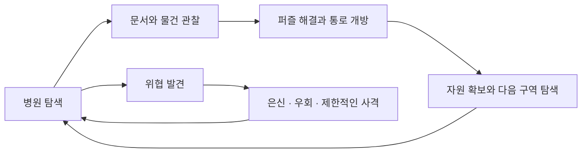

# SINGULARITY

**TEAM NIRIZ가 Unreal Engine 5.5로 개발하는 1인칭 바디캠 생존 공포 게임입니다.**

신경 침식 증상을 억제할 약을 찾아 병원에 들어갑니다. 흩어진 문서를 읽고, 물건과 단서를 조합해 닫힌 방을 열며, 제한된 탄약과 은신으로 위협을 피합니다. 치료의 실마리를 찾아가는 과정에서 병원에 남겨진 이야기를 알아갑니다.

> **2026년 9월 20일 기준, 개발 중입니다.** MVP1의 기본 플레이 흐름을 통합한 뒤 다음 기능을 확장하고 있습니다. 아래 게임 구성은 제작 목표이며, 구현 반영·검토 중·제작 예정 상태는 [개발 현황](docs/DEVELOPMENT.md)에서 구분합니다.

## 어떤 게임인가요?

| 구분 | 현재 제작 방향 |
| --- | --- |
| 팀과 플랫폼 | 3인 팀이 Windows PC와 Steam 출시를 준비합니다. |
| 공간 | 총 5층입니다. 1·2층은 병원, 3·4·5층은 병동으로 구성합니다. |
| 탐색과 이야기 | 문서 읽기, 열쇠 찾기, 물건 관찰과 퍼즐 해결로 새로운 방을 엽니다. |
| 생존 | 약과 주사를 구해 증상을 억제하고, 위험한 동선에서 사용할 자원을 관리합니다. |
| 두 적 | 총을 사용하지 않는 두 적을 계획합니다. 서서 걷거나 바닥·벽·천장을 기어다니는 위협을 제작합니다. |
| 은신과 대응 | 침대·책상 아래에 숨거나 우회합니다. 권총과 샷건은 부족한 탄약으로 위협을 물러나게 하는 수단입니다. |
| 사격 감각 | 화면 중앙 조준점과 정밀 조준 확대 없이, 총을 살짝 들어 총구 방향에 맞춰 발사합니다. |
| 연출 | 긴 시네마틱과 음성 대사보다 문서와 공간 탐색에 집중합니다. 적 접근·총성·문 등 판단에 필요한 기본 효과음은 유지합니다. |

## 먼저 확인할 문서

| 알고 싶은 내용 | 안내 |
| --- | --- |
| 어떻게 플레이하나요? | [게임 소개](docs/GAMEPLAY.md)를 확인합니다. |
| 어디까지 만들었나요? | [현재 개발 현황](docs/DEVELOPMENT.md)에서 반영한 기능과 후속 작업을 구분합니다. |
| 언제 공개하나요? | [제작 일정](docs/ROADMAP.md)에서 데모와 정식 출시 목표를 확인합니다. |
| 누가 무엇을 만들었나요? | [팀 기여](portfolio/README.md)에서 담당별 기록을 확인합니다. |
| 이전 성과와 배포 기록은 어디에 있나요? | [MVP1 기록](docs/MVP1-2026-09-09.md)과 [배포 이력](docs/RELEASES.md)을 확인합니다. |

## 팀

| 담당자 | 현재 담당 영역 |
| --- | --- |
| [메샤미](portfolio/meshami.md) | 기획·진행 관리, 플레이어 조작과 무기, 맵 진행, 저장, 전체 통합과 배포를 담당합니다. |
| [솔마님](portfolio/solma.md) | 두 적의 감지·추적·수색·공격, 애니메이션과 벽·천장 이동, 관찰한 행동에 한정한 학습을 담당합니다. |
| [푸우님](portfolio/pooh.md) | 아이템·상호작용, 퍼즐 공통 기반과 개별 퍼즐, 문서 읽기와 안내·설정 화면을 담당합니다. |

담당 영역에는 앞으로 제작할 기능이 포함됩니다. 실제 구현 성과는 각 담당 문서의 상태와 검증 범위를 함께 확인합니다.

**데모는 2026년 11월 말–12월 초, 정식 출시는 2027년 1–6월을 목표로 합니다.** 현재 공개 다운로드는 제공하지 않습니다. 공개 빌드와 실제 플레이 영상은 확인을 마친 뒤 [배포 이력](docs/RELEASES.md)에 추가합니다.

이 저장소는 공개 소개와 개발 기록을 위한 공간입니다. 게임 소스, 구매 에셋, 내부 작업지시서와 개인 가이드는 포함하지 않습니다. 이야기의 핵심 반전과 퍼즐 정답도 공개하지 않습니다.
