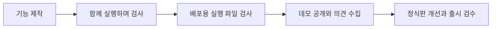

# SINGULARITY 제작 일정

**2026년 9월 20일 기준입니다.** 5층 병원 안에서 탐색·문서·퍼즐·생존을 연결하는 방향으로 범위를 정리했습니다. 이전의 구역별 확장 일정과 데모 목표를 아래 계획으로 변경합니다.

| 단계 | 목표 시기 | 진행 내용 |
| --- | --- | --- |
| 기본 플레이 흐름 | 2026년 9월 9일 통합 기록 | 플레이어, 권총, 적 AI, 열쇠·문과 화면 안내를 연결했습니다. [당시 기록](MVP1-2026-09-09.md)을 확인합니다. |
| 공통 기반과 초반 진행 | 2026년 9월 17일 이후~10월 초 | 조작 연결, 은신, 무기와 탄약, 두 적의 감지, 퍼즐 공통 기반을 차례로 연결합니다. |
| 전체 기능과 공간 통합 | 2026년 10월~11월 초 | 5층 진행, 퍼즐과 문서, 적 행동, 저장과 주요 진행 흐름을 연결합니다. |
| 데모 검수 | 2026년 11월 | 진행 차단, 저장 오류, 충돌과 성능 문제를 점검하고 배포 후보를 만듭니다. |
| 데모 공개 | **2026년 11월 말~12월 초 목표** | 검수를 마친 데모와 실행 안내, 알려진 문제를 공개합니다. |
| 정식판 개선과 출시 | **2027년 1~6월 목표** | 데모 의견을 반영하고 콘텐츠·저장 호환성·성능·배포 안정성을 검수합니다. |

데모와 정식 출시는 별도 단계입니다. 일정은 목표이며, 확정 출시일과 공개 범위는 검수 결과에 따라 안내합니다. 내부의 담당자별 마감과 작업 순서는 공개 일정에 포함하지 않습니다.

## 다음 단계로 넘어가는 기준

진행을 막는 오류, 저장 데이터 손상과 반복 충돌이 남은 빌드는 출시 완료로 표시하지 않습니다. 주요 진행 경로, 입력과 화면, 저장과 불러오기를 실제 배포용 실행 파일에서 확인합니다. 공개 빌드에는 버전, 실행 조건, 변경 내용과 알려진 문제를 함께 기록합니다.

[현재 개발 현황](DEVELOPMENT.md) · [배포 이력](RELEASES.md)
